# Apple 2026 Front-end Demo

一个以 Apple 官网为设计参考的纯前端学习项目。项目使用原生 HTML、CSS 与 JavaScript 构建，不依赖构建工具或后端服务，重点演示 2026 产品阵容展示、站内购买配置、购物袋、本地化和响应式交互如何协同工作。

> 本项目是独立的前端学习演示，不是 Apple 官方网站，也不代表 Apple Inc.。产品名称、商标和视觉参考归其各自权利人所有。

## 在线预览

- 本地预览：`http://127.0.0.1:4173/`
- GitHub Pages：可在仓库 `Settings → Pages` 中将部署来源设置为 `master` 分支根目录。

## 页面展示

### 首页

首页以 iPhone 18 Pro 的大幅产品视觉作为首屏入口，展示 iPhone Duo、MacBook Air M5、iPad Pro M5、Apple Watch Series 12 和 AirPods 5，并包含产品导航、滚动显现、产品横向浏览、外观预览、服务信息和站内购买入口。

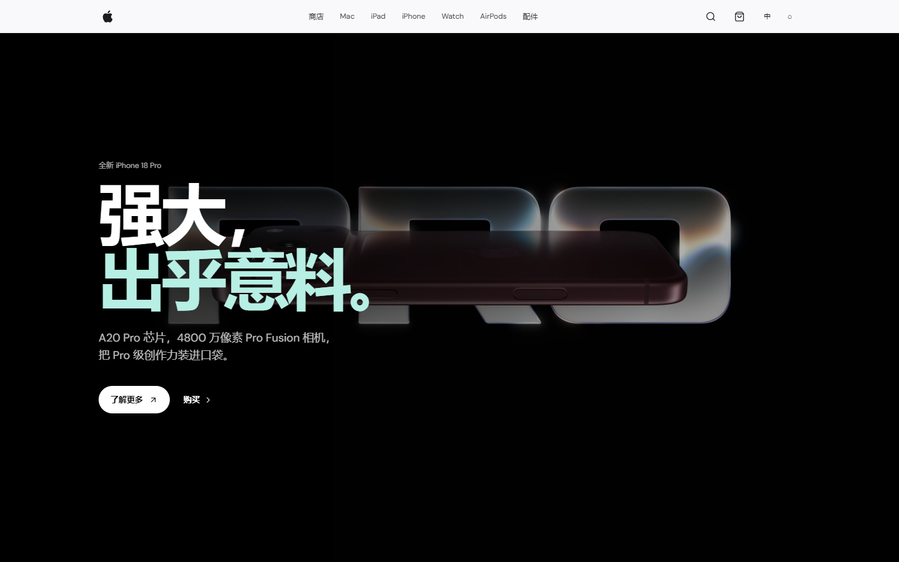

### 产品比较页

产品页将 iPhone、Mac、iPad、Apple Watch 和 AirPods 放在同一比较流程中，可选择最多三款产品，对照核心能力、适用场景、便携性、代表功能和起售价。

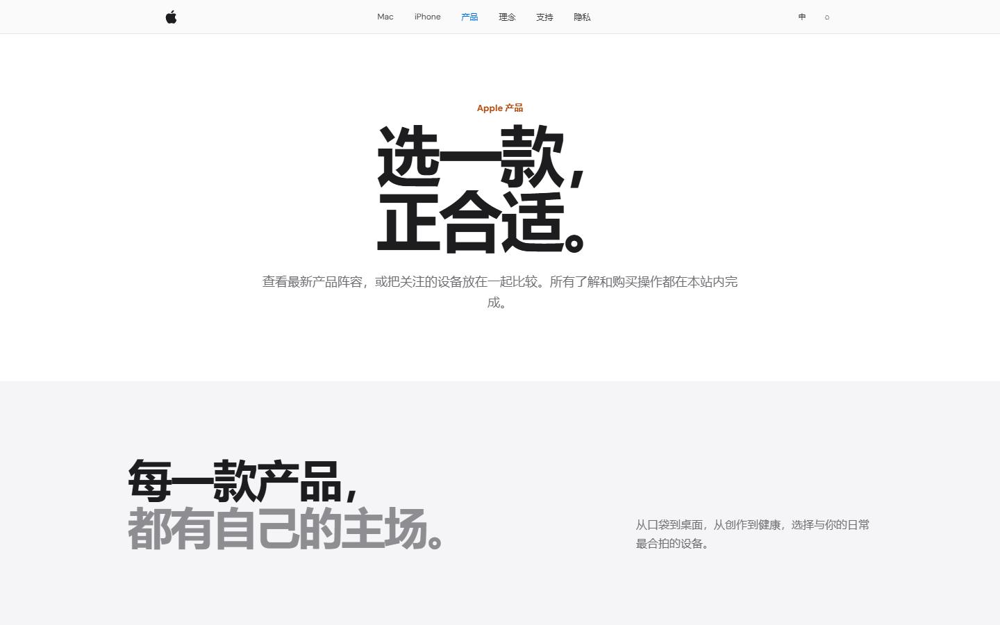

### 购买配置弹窗

购买流程完全留在演示站内。用户可以选择颜色、容量、内存与存储组合或表款规格，价格会随选择即时更新，然后将配置加入购物袋。

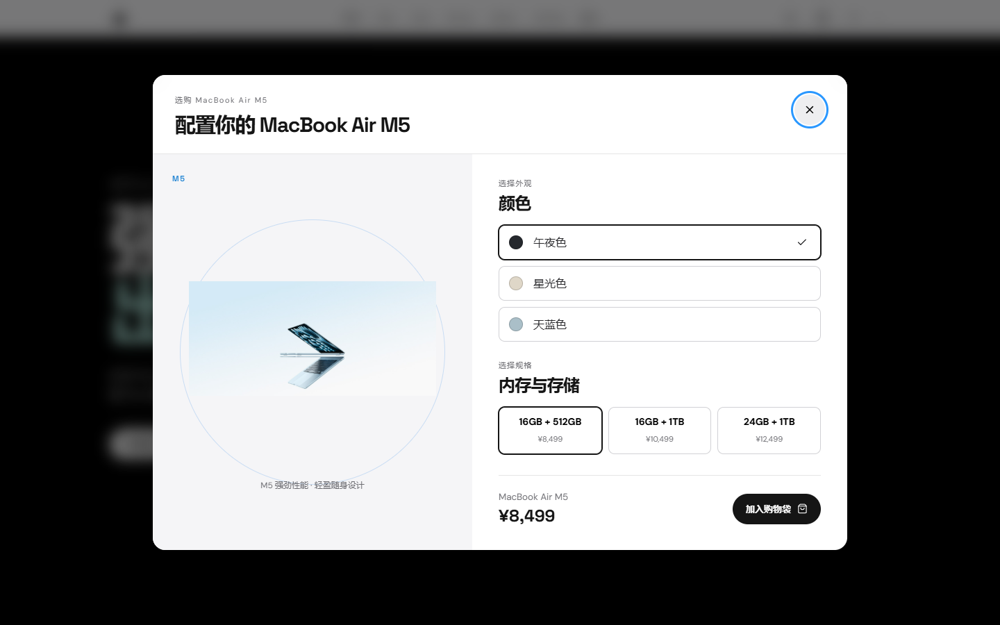

### 产品详情页

六个产品都有独立的详情页，沿用统一的详情页骨架，同时保留产品自己的视觉重点、核心指标、家族导航和购买入口。下面的截图均来自当前 2026 产品版本，不再使用旧的 iPhone 17 展示图。

<table>
  <tr>
    <td><strong>iPhone 18 Pro</strong><br>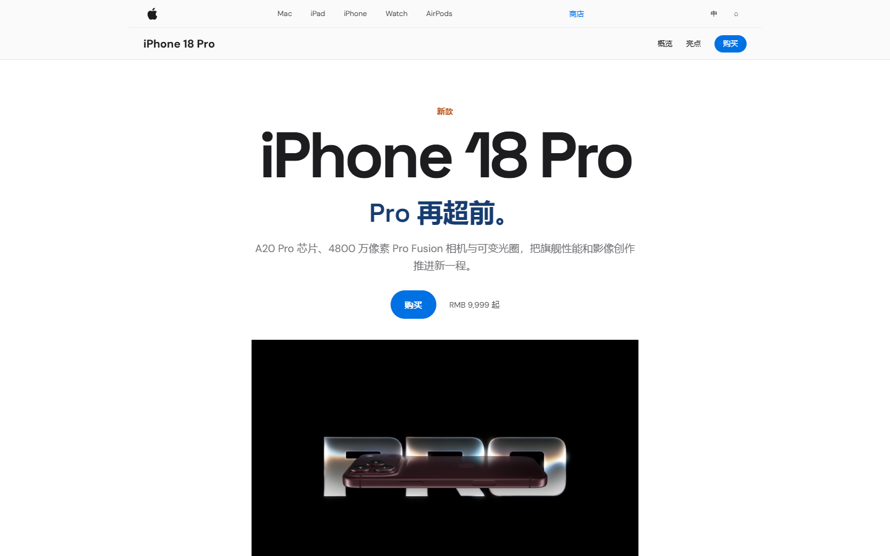</td>
    <td><strong>MacBook Air M5</strong><br>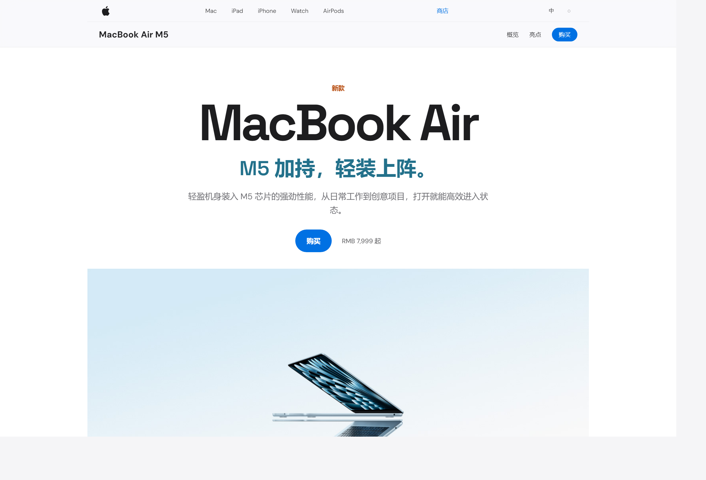</td>
  </tr>
  <tr>
    <td><strong>iPad Pro M5</strong><br>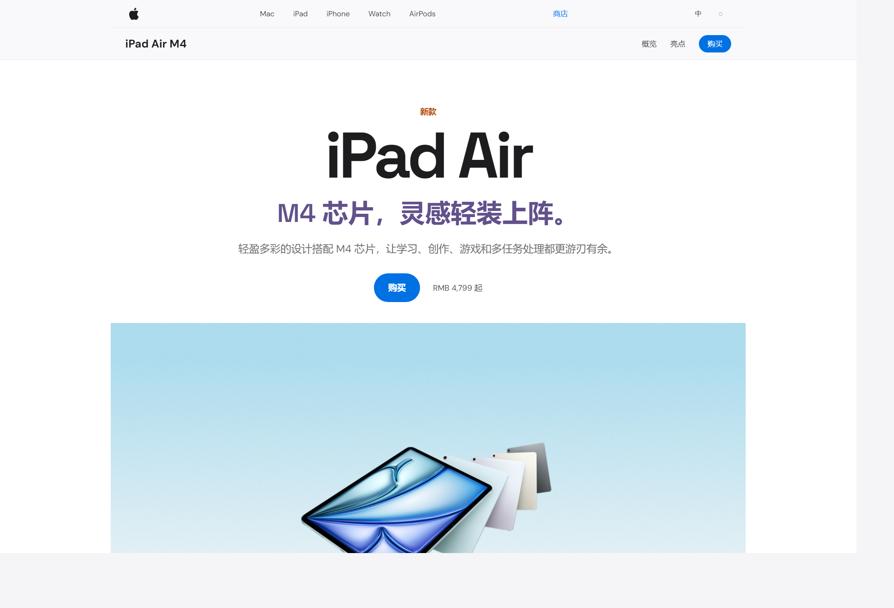</td>
    <td><strong>Apple Watch Series 12</strong><br>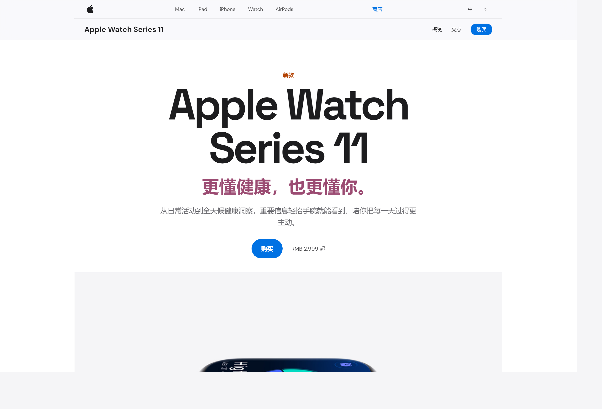</td>
  </tr>
  <tr>
    <td><strong>AirPods 5</strong><br>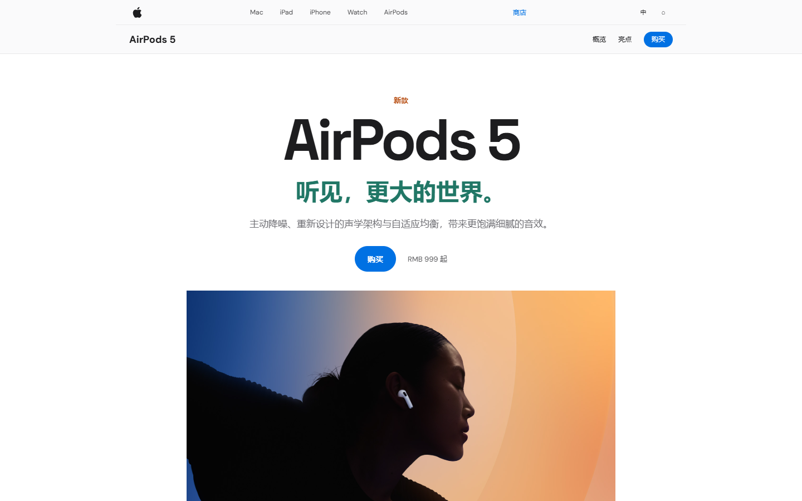</td>
    <td><strong>iPhone Duo</strong><br>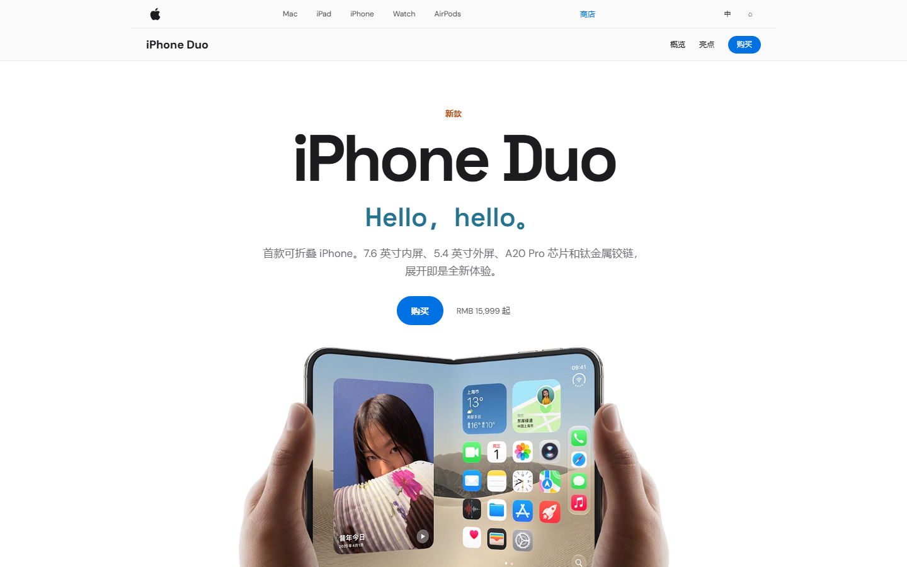</td>
  </tr>
  <tr>
    <td><strong>移动端首页</strong><br>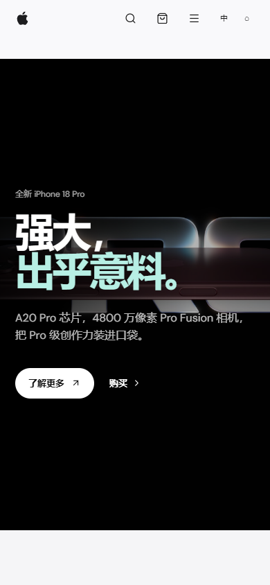</td>
    <td></td>
  </tr>
</table>

### 信息与隐私页面

支持、设计理念和隐私页面用于承载帮助内容、设计原则及浏览器本地数据说明，页面内的链接和操作仍然保持在本站范围内。

<table>
  <tr>
    <td><strong>支持</strong><br>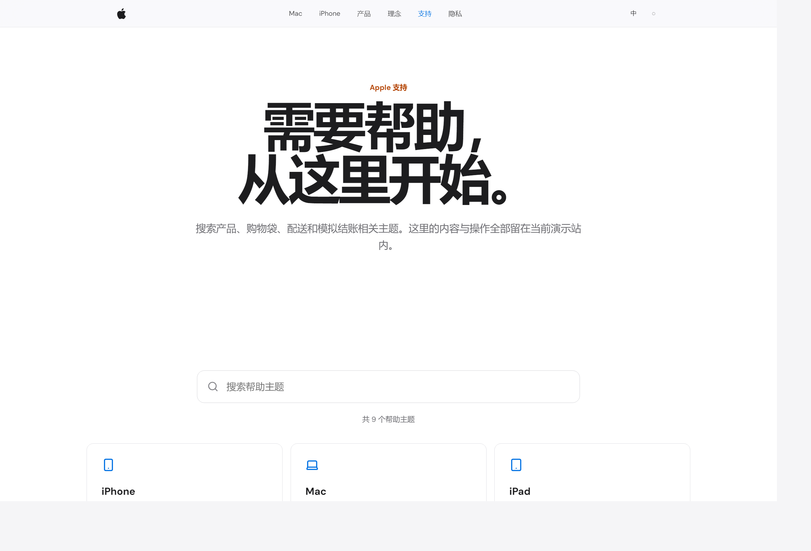</td>
    <td><strong>设计理念</strong><br>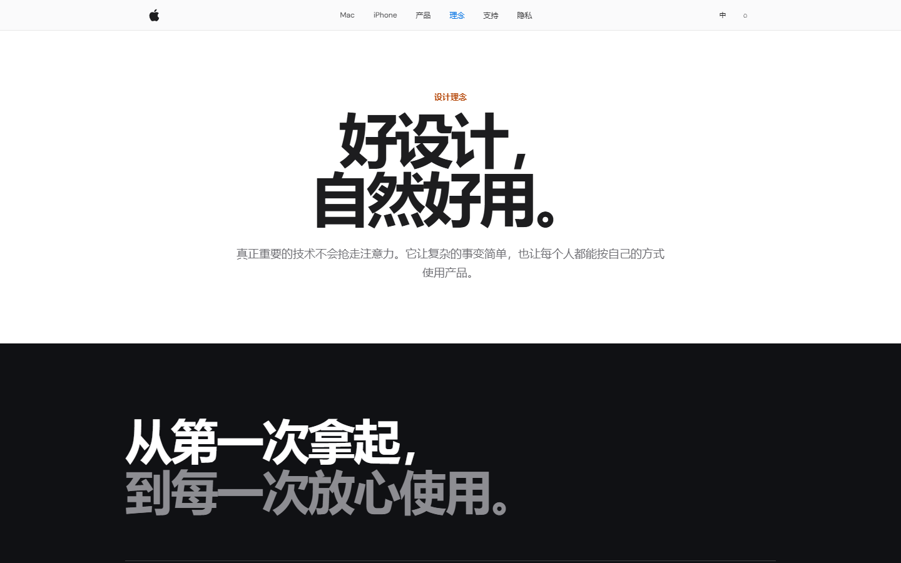</td>
  </tr>
  <tr>
    <td><strong>隐私与数据</strong><br>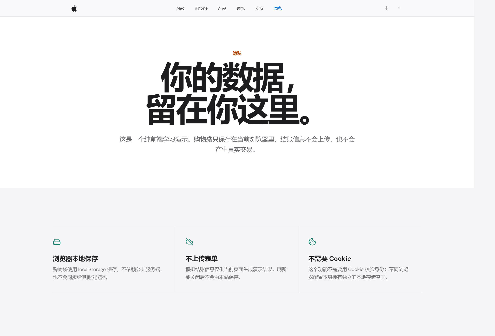</td>
    <td><strong>站内购买</strong><br></td>
  </tr>
</table>

## 功能特性

- Apple 风格的顶部导航、产品卡片、留白比例、圆角面板和克制的动效。
- iPhone 18 Pro、iPhone Duo、MacBook Air M5、iPad Pro M5、Apple Watch Series 12、AirPods 5 六类产品展示。
- 产品详情页、产品比较页、支持页、设计理念页和隐私说明页。
- 站内购买配置：颜色、容量、内存与存储、表款和产品款式均可选择。
- 购物袋：加入商品、修改数量、删除商品、查看小计和模拟结账。
- 购物袋使用当前浏览器的 `localStorage` 保存，不使用共享服务端数据。首次打开新的浏览器配置时购物袋为空，不同浏览器或设备之间不会互相看到商品。
- 模拟结账：表单只用于当前页面展示订单结果，不连接支付、库存、配送或数据库。
- 简体中文、繁體中文、English 三种语言即时切换。
- 使用语义化翻译 key 管理页面文字、按钮、`aria-label`、`alt`、`title`、占位符和页面标题。
- 使用 i18next 浏览器包处理资源加载、插值和回退；OpenCC-JS 用于繁体中文文本转换的兼容处理。
- 动态效果可在网页设置中关闭，并单独保存语言偏好和动效偏好。
- 响应式布局覆盖桌面端和移动端，支持键盘焦点与基础无障碍标签。
- 所有站内链接均指向本项目页面，不会把用户跳转到真实 Apple 官网。

## 技术架构

项目采用无构建链的静态目录结构，浏览器直接加载 HTML、CSS 和 JavaScript：

```text
.
├── index.html                 # 首页
├── script.js                  # 首页交互、购买配置和购物袋
├── detail.js                  # 产品详情页通用交互
├── info.js                    # 支持、理念、隐私等信息页交互
├── preferences.js             # 语言与动态效果偏好面板
├── i18n.js                    # i18next 初始化、翻译渲染和语言切换
├── locales/                   # zh-CN、zh-TW、en 语言资源
├── vendor/                    # 固定版本的本地第三方浏览器包
├── assets/                    # Apple 标志和产品图片
├── iphone/                    # iPhone 18 Pro 详情页
├── iphone-duo/                # iPhone Duo 折叠屏详情页
├── mac/                       # MacBook Air M5 详情页
├── ipad/                      # iPad Pro M5 详情页
├── watch/                     # Apple Watch Series 12 详情页
├── airpods/                   # AirPods 5 详情页
├── products/                  # 产品比较页
├── support/                   # 支持页
├── values/                    # 设计理念页
├── privacy/                   # 隐私说明页
└── docs/screenshots/          # README 展示截图
```

### 国际化设计

页面结构使用 `data-i18n` 和 `data-i18n-attr` 标记可翻译内容，JavaScript 动态文案统一通过 `t(key, variables)` 获取。语言资源集中在 `locales/`，因此修改一处页面文案时，只需要维护对应 key 的语言资源，不需要再次扫描并替换整段页面文字。

语言切换会同步更新：

- `document.documentElement.lang`；
- 页面标题、导航、按钮和提示信息；
- 购买配置中的颜色、容量、尺寸和价格说明；
- 购物袋商品名称、规格、数量、结账摘要和模拟订单结果；
- `aria-label`、`alt`、`title` 和输入框 `placeholder`。

没有专用翻译 key 的规格值（例如 `16GB + 256GB`、`42mm GPS`）会保留原始值或使用文本回退，避免规格只剩价格。

### 浏览器存储策略

购物袋 key 为 `apple-inspired-cart-v3`，语言偏好和动态效果偏好分别使用独立 key。数据只写入当前站点、当前浏览器配置的本地存储，不会上传到网络。隐私页提供清除当前浏览器购物袋数据的入口。

## 本地运行

项目不需要安装 Node.js 依赖。使用 Python 启动一个静态文件服务器即可：

```powershell
cd D:\Learning\苹果
python -m http.server 4173 --bind 127.0.0.1
```

然后打开 <http://127.0.0.1:4173/>。

关闭服务端口：

```powershell
$pid4173 = (Get-NetTCPConnection -LocalPort 4173 -State Listen).OwningProcess
Stop-Process -Id $pid4173
```

也可以直接双击项目中的 `运行脚本.txt` 查看常用命令。

## 验证清单

提交前建议执行：

```powershell
node --check script.js
node --check detail.js
node --check info.js
node --check i18n.js
git diff --check
```

手动检查：首页、六个产品详情页、产品比较页、支持页、理念页和隐私页分别切换简体中文、繁體中文与 English；验证购买配置、购物袋数量修改、删除、结账和模拟下单流程；在桌面端与 375px 左右的移动端检查无横向溢出。

## 版权与免责声明

页面底部统一使用：`Copyright © 2026 Apple Inc. 保留所有权利。此页面为纯前端学习演示。`

本仓库仅用于学习 HTML、CSS、JavaScript、浏览器存储、国际化和交互设计。项目不提供真实商品、真实库存、真实支付或真实配送服务。
